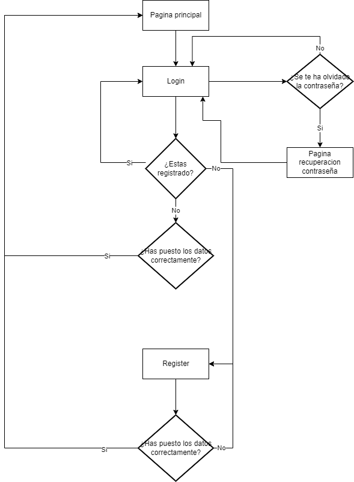
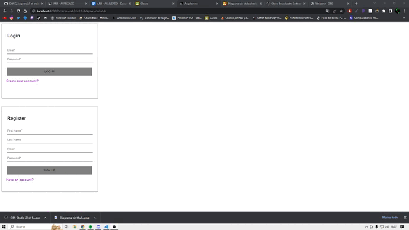

## Programación Orientada a Objetos

> Tarea AVANZADA.

### Analisis del problema 👨‍🏫

#### 1. Seguir los pasos de instalación del vídeo suministrado “Instalación Angular.mp4”.

#### 2. Crear los componentes que se indican en la siguiente imagen con la ayuda del vídeo “Componentes Angular.mp4”.

#### 3.Añadir las verificaciones de cada input-botón mostrando un error en caso de que no se cumplan:

- Email: Debe ser un email con su @ y otras validaciones. Buscar en internet. No debe estar vacío.
- Password: No deben mostrarse los caracteres, sólo los puntos. No debe estar vacío.
- Last Name: Puede estar vacío. Es un input normal.
- First Name: No puede estar vacío. Es un input normal.
- Botón con texto: Puede estar habilitado o deshabilitado.
- Hiperenlace: Mostrará diferentes textos.
        
#### 4. Añadir un componente que se pueda utilizar para el proyecto individual.

#### 5. Realizar un boceto de cada una de las pantallas que se vayan a utilizar en el proyecto individual con la finalidad de reutilizar este trabajo y así reducir el esfuerzo total.

    
  

### Diseño de la solución 📊

  

### Implementacion ⚒

He realizado el login y register de la pagina.
  

### Pruebas 👨🏻‍💻

##### Prueba funcionamiento del buscador:

