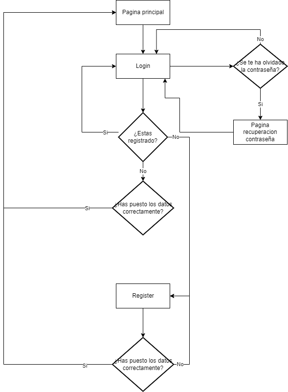
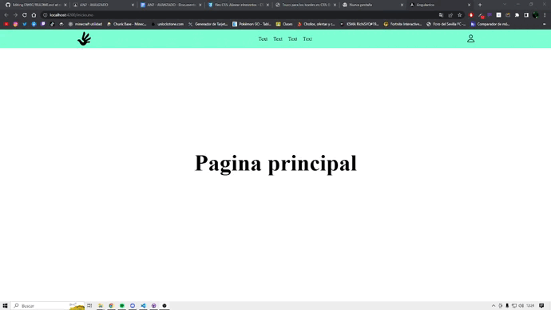

## Programación Orientada a Objetos

> Tarea AVANZADA.

### Analisis del problema 👨‍🏫

#### 1. Siguiendo el boceto del anterior boletín avanzado o suministrando uno más actualizado para el proyecto individual. Establecer toda la navegación entre componentes o páginas del proyecto individual, aplicando las validaciones que se vean oportunas en el caso que toque.

    
  

### Diseño de la solución 📊

  

### Implementacion ⚒

He realizado la estructura de la pagina.
  

### Pruebas 👨🏻‍💻

##### Prueba funcionamiento del login y register:

