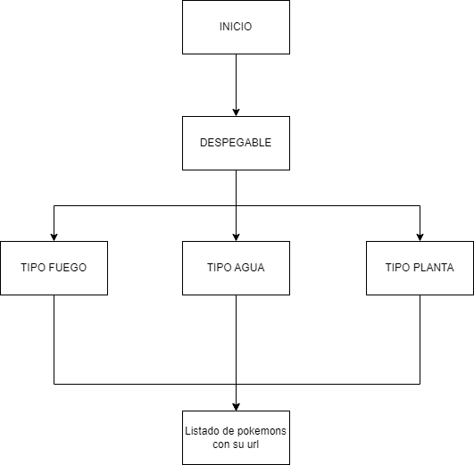
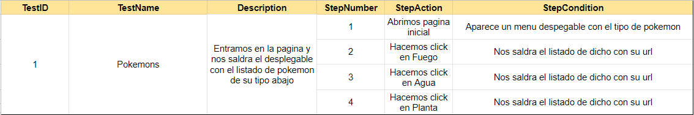
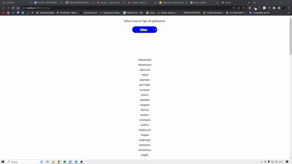

## Programación Orientada a Objetos

> Tarea AVANZADA.

### Analisis del problema 👨‍🏫

#### 1.Aplicar los conceptos dados en la teoría para ampliar las funcionalidades del proyecto utilizando las directivas explicadas y la comunicación entre componentes.

#### 2. Investigar sobre las directivas ngStyle, ngClass y ngTemplate y darle un uso en el proyecto si se viese necesario y mostrar ejemplos en el Readme.md.

### ngStyle

#### Una directiva de atributo que actualiza los estilos del elemento HTML que lo contiene. Establece una o más propiedades de estilo, especificadas como pares clave-valor separados por dos puntos.

        @Input()
        ngStyle: { [klass: string]: any; }
        
### ngClass

#### Agrega y elimina clases CSS en un elemento HTML.

        @Input()
        ngClass: string | string[] | Set<string> | { [klass: string]: any; }
        
### ngTemplate

#### El elemento de Angular <ng-template>define una plantilla que no se representa de forma predeterminada.
    
        @Input()
        ngClass: string | string[] | Set<string> | { [klass: string]: any; }

    
  

### Diseño de la solución 📊

  

### Implementacion ⚒

He realizado un desplegable con los tipo de pokemon(Fuego, Agua y Planta).
  

### Pruebas 👨🏻‍💻

##### Plan de pruebas:

#### Prueba

