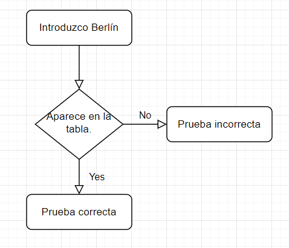
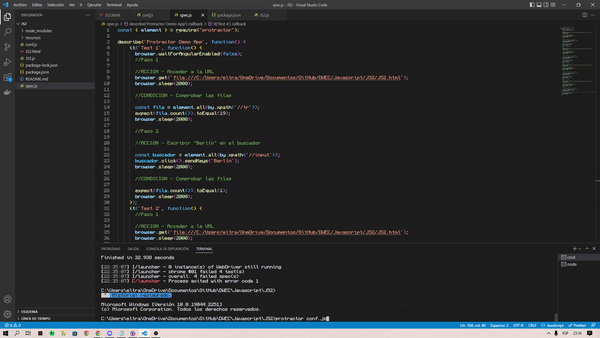

## Programación Orientada a Objetos

> Tarea AVANZADA.

### Analisis del problema 👨‍🏫

##### He buscado sobre las siguiente definiciones o terminos: 

### JSON: 
+ JSON es un formato de texto sencillo para el intercambio de datos. Se trata de un subconjunto de la notación literal de objetos de JavaScript, 
aunque, debido a su amplia adopción como alternativa a XML, se considera un formato independiente del lenguaje.
  

### Sintaxis JSON:

    [
      {
        "nombre": "Pepito Conejo",
        "edad": 25,
        "carnet de conducir": true
      },
      {
        "nombre": "Ana Barberá",
        "edad": 90,
        "carnet de conducir": false
      }
    ]

  

### Diseño de la solución 📊

  

### Implementacion ⚒

He realizado los pasos de los enunciado y del video para hacer el ejercicio avanzado.
  

### Pruebas 👨🏻‍💻

##### Prueba del ejercicio:

