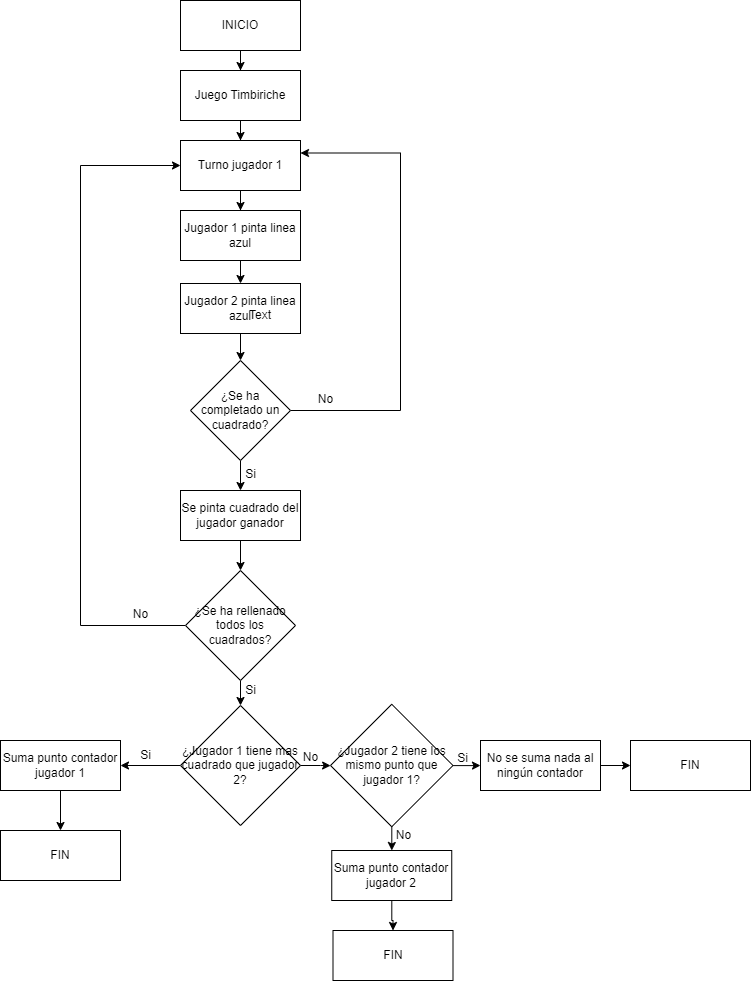
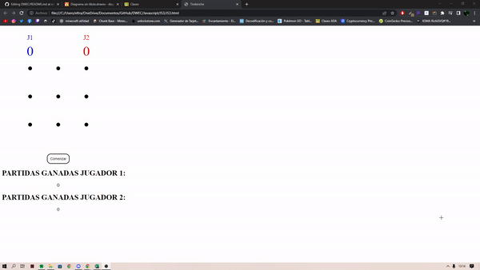
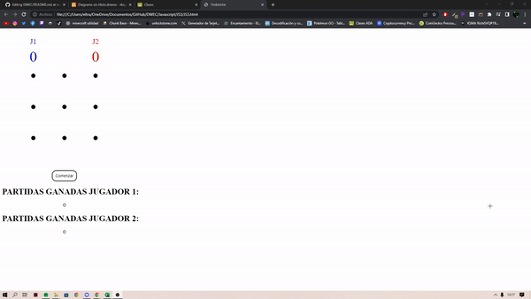
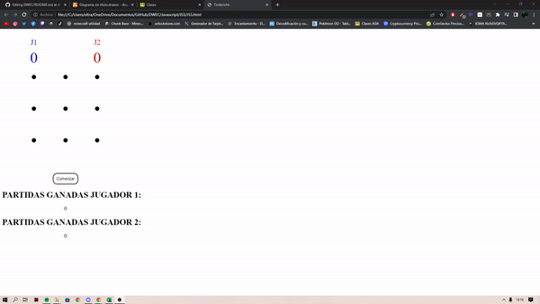

## Programación Orientada a Objetos

> Tarea AVANZADA.

### Analisis del problema 👨‍🏫

#### He buscado el funcionamiento de los distintos metodos y su sintaxis: 

#### SetTimeout(): 
+ El método setTimeout() permite ejecutar un fragmento de código, una vez transcurrido un tiempo determinado. Puedes pensar en el método como una forma de establecer un temporizador para ejecutar código de JavaScript en un momento determinado.
  

### Sintaxis SetTimeout:

    
    setTimeout(function(){
        console.log("Hola Mundo");
    }, 2000);

    console.log("setTimeout() Ejemplo...");
    
  

#### onclick: 
+ El evento onclick en JavaScript te permite como programador, ejecutar una función cuando se le da clic a un elemento.
  

### Sintaxis onclick:

    
    <button onclick="miFunc()">Haz click</button>

    
    
  

### Diseño de la solución 📊

  

### Implementacion ⚒

He realizado el juego timbiriche.
  

### Pruebas 👨🏻‍💻

##### Prueba jugador1 ganador:

##### Prueba jugador2 ganador:

##### Prueba Empate:

