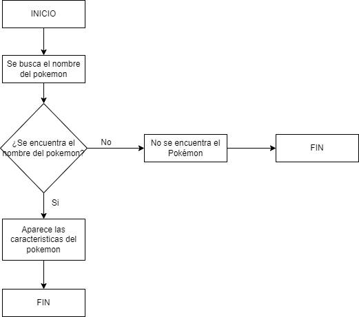
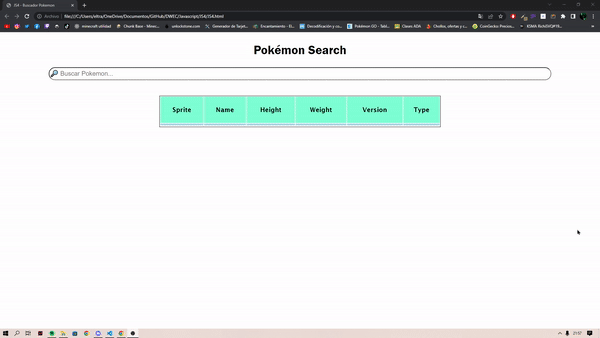

## Programación Orientada a Objetos

> Tarea AVANZADA.

### Analisis del problema 👨‍🏫

#### He buscado la definicion de xhr: 

##### Es una interfaz empleada para realizar peticiones HTTP y HTTPS a servidores Web. Para los datos transferidos se usa cualquier codificación basada en texto, incluyendo: texto plano, XML, JSON, HTML y codificaciones particulares específicas. La interfaz se implementa como una clase de la que una aplicación cliente puede generar tantas instancias como necesite para manejar el diálogo con el servidor.

##### El uso más popular, si bien no el único, de esta interfaz es proporcionar contenido dinámico y actualizaciones asíncronas en páginas web mediante tecnologías construidas sobre ella como por ejemplo AJAX.
    
  

### Diseño de la solución 📊

  

### Implementacion ⚒

He realizado el buscador de pokemon.
  

### Pruebas 👨🏻‍💻

##### Prueba funcionamiento del buscador:

