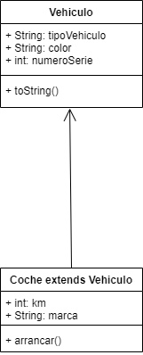
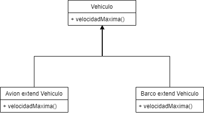
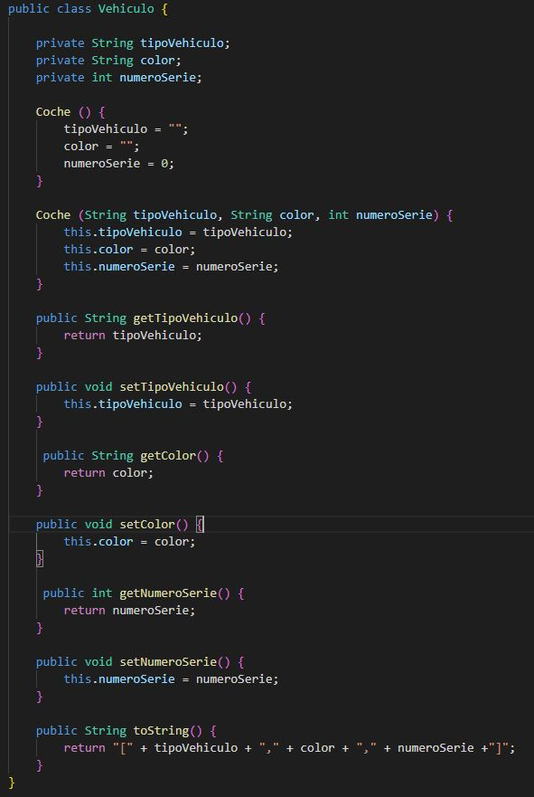
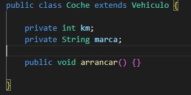
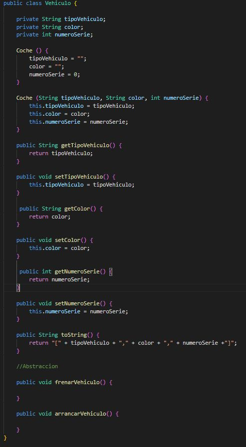
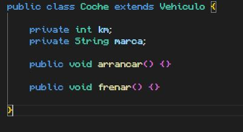
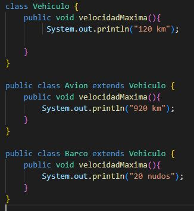

## Programación Orientada a Objetos

> Tarea AVANZADA.

### Definicion 👨‍🏫

#### Encapsulacion:

- Decimos que el encapsulamiento en la programación orientada a objetos es cuando limitamos el acceso
o damos un acceso restringido de una propiedad a los elementos que necesita un miembro y no a ninguno más.

- El elemento más común de encapsulamiento son las clases, donde encapsulamos y englobamos tanto métodos como
propiedades.

- Otro ejemplo muy común de encapsulamiento son los getters y setters de las propiedades dentro de una clase. Por defecto nos
dan el valor “normal” pero podemos modificarlos para que cambie.

#### Abstraccion:

- La abstracción consiste en captar las características y funcionalidades que un objeto desempeña y estos son representados
en clases por medio de atributos y métodos de dicha clase.

#### Herencia:

- Herencia es un concepto de la programación orientada a objetos. El cual es un mecanismo que permite
derivar una clase a otra clase.

- En otras palabras, tendremos unas clases que serán hijos, y otras clases que serán padres.

- Las clases hijas pueden utilizar tanto sus métodos y propiedades como de la clase padre, siempre que
su modificador de acceso lo permita.

#### Polimorfismo:

- polimorfismo es la capacidad que tienen los objetos de una clase en ofrecer respuesta distinta e independiente en función
de los parámetros utilizados durante su invocación. Dicho de otro modo el objeto como entidad puede contener valores de diferentes
tipos durante la ejecución del programa.

### UML 📊

### Pruebas 👨🏻‍💻

- #### Encapsulacion.

- #### Herencia.

- #### Abstraccion 1.

- #### Abstraccion 2.

- #### Polimorfismo.

